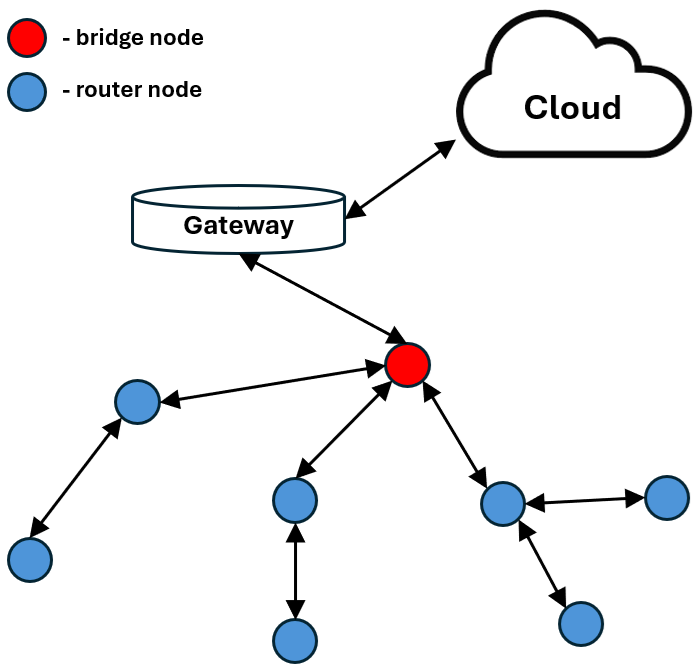
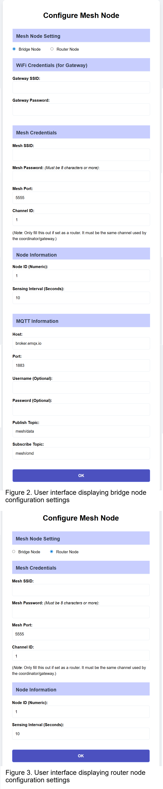

# NexMesh: Field-Configurable ESP Mesh Node for BEMS
This sketch provides the firmware for ESP microcontrollers (ESP8266 and ESP32) and is mainly intended for Building Energy Management System (BEMS) applications.

### Overview

A key component in BEMS is the ability to have fine-grained monitoring of a building's environmental metrics such as room temperature, humidity, air quality, light intensity, occupancy, and so on. This is implemented using a wireless sensor network of heterogeneous sensors that gather data and send it to a central command center, typically located in the cloud.

In most cases, the mesh network topology (see Figure 1 above) is preferred for its wider coverage and ability to navigate sensing areas with many obstructions, which is common in smart buildings. This sketch is intended for nodes of a mesh composed of:



* **Router Nodes**: Sense data at a pre-defined interval and send it to the bridge node through multi-hop communication.

* **Bridge Node**: Connected to the internet through a WiFi gateway. It publishes its own data and the data received from other nodes in the mesh to an MQTT topic.

The Challenge & Solution

One of the main challenges in deploying such meshes is adaptability. There is a need for nodes that can easily adapt to changing environments (e.g., changing WiFi credentials, API support) and are easily programmable for different sensing requirements.

This work introduces ***NexMesh***, an architecture based on the [painlessMesh](https://github.com/gmag11/painlessMesh/tree/master) library that decouples the sensing component of a node from its network configuration. This allows for fast, field-configurable deployment of mesh WSNs that connect to the cloud via MQTT. This is accomplished by dividing the architecture into two components:

1. **Sensing Logic (Pre-deployment)**: Programmed once. Ideally, this is the only component where the user adds sensor-specific functionalities.

2. **Network Configuration (Deployment)**: Handles all networking configurations (Mesh SSID/password, WiFi gateway credentials, MQTT info) and is invoked during deployment.

### Usage

To ensure the sketch compiles and runs correctly, you must install the following libraries in your Arduino IDE. The code has been tested and verified with these specific versions:

* painlessMesh (v1.5.7)
* PubSubClient (v2.8.0)
* ArduinoJson (v7.0.4)
  
**1. Pre-deployment (Sensing Logic)**. 
During pre-deployment, the user chooses the sensors the nodes will interface with. You must add the sensor-specific Arduino libraries and logic to the specific sections of the sketch outlined below.

**A. Library & Variable Declaration.** Add global variables and objects associated with the sensors in the global variable declaration section:
```c++ 
// ----- Sensor Libraries, Global Variables/Constants & Sensor Definitions ----- 
// Add sensor-specific libraries (START)

// [INSERT LIBRARY DECLARATIONS HERE]

// Add sensor-specific libraries (END)

// Add global variables and constants for the sensing logic (START)

// [INSERT YOUR SENSOR VARIABLES HERE]

// Add global variables and constants for the sensing logic (END)

```
**B. Initialization.** Add initialization, configuration, discovery protocols, and GPIO assignments in the `setup()` function:
```c++
// ----- Initialization & Device Discovery -----
// Initialize sensor variables, objects, etc. (START)

// [INSERT YOUR SENSOR SETUP CODE HERE]

// Initialize sensor variables, objects, etc. (END)

// ----- Device Discovery -----  
// Execute sensor setup and device discovery (START)

// [INSERT YOUR SENSOR DISCOVERY CODE HERE]

// Execute sensor setup and device discovery (END)
```
**C. Data Acquisition.** The reading of sensor data is handled by the `getSensorData()` function, which is called by a background task periodically at a field-determined interval. Add your reading algorithms here:
```c++
// ----- Data Acquisition & Sensing Logic ----- 
// Read sensor data (START)

// [INSERT SENSOR READING LOGIC HERE]

// Read sensor data (END)
```
*Note:* If additional functionality is required (e.g., conditional transmissions), these can be added in the `sendSensedData()` function. Once these sensing logics are added, flash the sketch onto the desired ESP.

**2. Deployment (Configuration).**
During deployment, nodes are assigned IDs, roles, and sensing intervals. Nodes can be configured as either a Router or a Bridge.

**Initial Setup:**
1. When initially flashed (or reset), the node acts as an Access Point (AP).
2. Connect a laptop or smartphone to the default SSID: MeshConfigAP.
3. Open a browser and navigate to: http://192.168.4.1.
4. The Web UI configuration page will load.

**Configuration A: Bridge Node** (Figure 2)



By default, the Bridge Node configuration is selected in the UI. A Bridge connects to a WiFi gateway to reach the internet.
1. *WiFi Credentials*: Enter the SSID and Password for the building's WiFi Gateway.
2. *Mesh Credentials*: Enter the Mesh SSID and Password. Note: All nodes on the same mesh must use the same credentials.
3. *Channel ID* (Important):
    * ESP32: This field can be ignored (auto-handled).
    * ESP8266: The node must use the same channel as the WiFi Gateway. Since the Bridge must search for the gateway to extract the channel, the node must be within the vicinity of the WiFi Gateway during configuration.
4. *Node ID & Interval*: Set the user-defined Node ID (unique to each node) and sensing interval.
5. *MQTT Information*: Enter the Host URL, Port, Username/Password (optional), and publish/subscribe topics.

Click OK. The ESP will save settings to EEPROM and display a reply message. Note: For ESP8266, this reply displays the Channel used by the gateway, which is required for configuring Router nodes.

**Configuration B: Router Node** (Figure 3)

To configure a node as a Router, select the Router Node radio button. The form will update (WiFi and MQTT sections will be hidden).
1. *Mesh Credentials*: Input the exact same Mesh SSID and Password as the Bridge node.
2. *Channel*:
    * ESP8266: Input the same channel used by the Bridge node (as displayed during Bridge configuration).
3. *Node ID & Interval*: Set the unique Node ID and sensing interval.

Click OK to save to EEPROM. The ESP will restart and operate as a node in the mesh.

**Reset & Re-configuration**

A physical reset button allows users to wipe the configuration and return the node to AP mode.

* ESP8266 (NodeMCU): GPIO13 (Pin D7)
* ESP32: GPIO5

Note: Pin assignments can be changed by modifying RESET_BUTTON_PIN in the sketch.

To Reset: Press and hold the pin for more than 10 seconds. The node will flash the EEPROM, remove configurations, and reset into AP mode.
